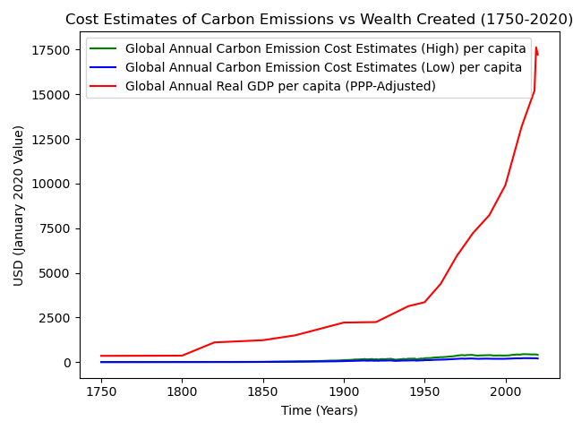

# Aim
This project aims to consolidate data from different sources and compare the increase in created wealth against the increase in costs of created carbon emissions from existing economic practices.

# Methodology
## Main Software and Frameworks Used
1. **JupyterLab** was used as the development environment.
2. **Pandas** and **Numpy** were used for construction of datasets.
3. **matplotlib** was used for the plotting of data.

## Choice of Variables
1. Time frame  --> 1750 - 2020
2. Wealth created --> Global Real GDP per capita (PPP-adjusted in terms of USD value as of Jan 2020)
3. Carbon emissions --> Global Annual Carbon emissions (tons)
4. Carbon Pricing Scheme --> Low Range: 40-50 USD/ton; High Range: 80-100 USD/ton (suggested by Carbon Pricing Coalition Leadership)

## Data Sources
1.  Annual Global CO2 Emissions in Tons  
> 1750-2020: Global Carbon Budget - Global Carbon Project (v2021) https://doi.org/10.18160/gcp-2021
2.  Global Population
> 1750, 1760, 1770, 1780, 1790: Historical estimates - HYDE (v3.2) https://dataportaal.pbl.nl/downloads/HYDE/
> 1800-1949: Historical estimates - Gapminder https://www.gapminder.org/data/documentation/gd003/
> 1950-2020: Population records - United Nations Population Division (2022) https://population.un.org/wpp/Download/Standard/Population/
3. Carbon Pricing Scheme
> Report of the High-Level Commission on Carbon Prices - Carbon Pricing Coalition Leadership https://www.carbonpricingleadership.org/report-of-the-highlevel-commission-on-carbon-prices
4. Currency Converter
> US CPI Inflation Calculator - US Bureau of Labor Statistics https://data.bls.gov/cgi-bin/cpicalc.pl

Any missing values are interpolated via `pandas.Series.interpolate(method='linear')` or `pandas.Dataframe.interpolate(method='linear')`.

## Construction of Data   
1. Refer to `Annual CO2 Emssions Data Cleaning.ipynb` for finding annual global CO2 emissions in tons .
2. Refer to `Annual CO2 Emissions to Cost (tons to USD).ipynb` for  finding annual global cost estimates of CO2 emissions.
3. Refer to `Cleaning Global Population Data.ipynb` for finding annual global population.
4. Refer to `Creation of GDP Stats.ipynb` for finding annual global real GDP per capita in USD at its value in 2020. 
5. Refer to `Compilation.ipynb` for creation of a dataframe consisting of corresponding yearly cost and wealth data. 
6. Refer to `Comparison.ipynb` for creation of a plot of wealth created vs cost. 

## Evaluation
  

As seen above, the data shows that the real GDP per capita far exceeds the per capita cost estimates of carbon emissions. However, one should not immediately jump at the conclusion that the wealth gained far exceeds the carbon-induced environmental costs and that current economic and environmental practices are optimal.  

This is for two reasons.  

Firstly, although the carbon tax pricing scheme used in this analysis is far higher than any current instances, the Carbon Pricing Coalition Leadership might have lowered their original numbers (i.e. ones more representative of actual cost to the environment) to increase adoption by countries which are more economic-driven.  

Secondly, the actual environmental cost of current economic practices are cannot merely be quantified based on the cost of carbon emissions. The actual aggregate cost would necessarily have to include the cost of CFC emissions, the cost of deforestation and the cost of marine pollution among other effects.  

When all the costs are summed up, the summed cost may very well exceed the value of created wealth.
